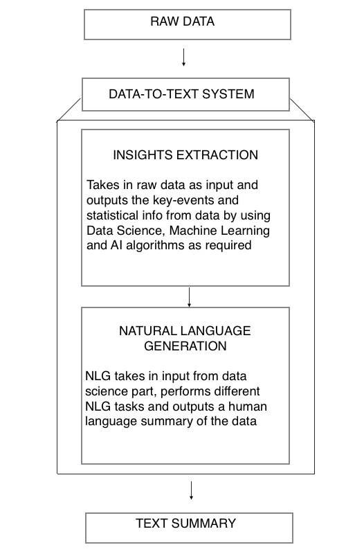

# Data-to-Text System

This repository is a brief description of the work I did during my Summer Internship at [cuddle.ai](http://www.cuddle.ai), a subsidiary of [Fractal Analytics Pvt. Ltd.](https://fractalanalytics.com). I cannot share the codes due to the Non-Disclosure Agreement signed. The Problem presented, the Approach I took and the Results obtained is displayed below.

## Introduction

Data-to-text systems are systems that generates texts from non-linguistic input data. Such systems needs to perform data analysis as well as linguistic processing. Data-to-text systems are powerful in generating reports from data automatically and thus they simplify the representation of complex data with numerous datapoint.
 
Data-to-text Systems are primarily comprised of two sub-systems:
 
1.	Numerical Insights Extraction
2.	Natural Language Generation
 
The architecture of a typical data-to-text system is shown below:
 

	</IMG>

### Insights Extraction

### Natural Language Generation

Natural Language Generation systems aims at providing insights by processing huge chunks of data and generation a Human Readable textual summary. In NLG, system needs to make decisions about how to put concepts into words.
 
Natural Language Generation systems are not simply Natural Language Understanding systems run “in-reverse”. One of the most prominent difference between NLG and other types of NLP is the central role of choice making. Choice making is more central to NLG than other areas of NLP.
 
Different Natural Language Generation tasks are:

#### Document Planner



Document Planner step involves the following:
 
1.	Content Determination: This decides what information to communicate in the text
 
2.	Document Structuring: This decides how this information is organised in the generated text


 
The input to document planner is the input to entire NLG system. The output of document planner is a tree of messages. Messages are chunks of information(extracted from input data) which can be linguistically expressed as a clause or phrase. The edges of the tree are often used to represent rhetorical relations between messages.


#### Micro-planning



Micro-planning deals with how information is linguistically expressed in generated text.
This involves four parts:
 
1.	Lexical choice: choosing which concept word to use to express domain concepts and data
 
2.	Referring: choosing referring expressions to identify domain entities
 
3.	Syntactic choice: syntactic structure in generated text sentence
 
4.	Aggregation:  choosing how many messages should be expressed in each sentence

  
The input to micro-planner is the document plan. The output of the micro-planner is the text specification. Essentially this is a tree whose internal nodes specifying document structure(eg: paragraph) and whose leaf node specify deep syntactic structures of sentences. Micro-planning requires an NLG system to make decision about the best way to linguistically express information.


#### Realisation



The realiser generates the Surface form(actual form) based on the information selected by the document planning and the linguistic choice made by micro-planner. Realiser connects the different parts of sentences by making the required changes and adding the required features.
 
There are some methods for evaluation of the generated text by an NLG system like **BLEU**(Bilingual Evaluation Understudy) but the best method by far is Human evaluation. Extrinsic evaluation or metric based corpus evaluation are based on pattern matching or comparisons with reference text. These scores are good to get a preliminary idea of how the model is performing but not to present end results. A human evaluator can present diversity and make changes as required to make the system perform better.

## Problem

## Approach

## Results

## Conclusion

Data-to-Text Systems are extremely useful. Large amount of data is generated on daily basis and its hard for a human to handle such amount of data in less time. Data-to-Text Systems acts as a bridge between huge amount of available data and the hidden insights within.
 
The data-to-text system created during my internship gives can act as a start to create a state-of-art Natural Language Generation system. The data generated can be collected in a database, which can later be used to train a Deep Learning Sequence models.
 
The system created has a large scope for improvement. The sentences generated can be reframed to be more presentable and useful for business purpose. An extensive survey about the expected output can be useful to get a more clear vision about future works. More relevant words can be added to the dictionary to provide more variety in generated text. The type of statistical information displayed can be varied depending upon the business requirements and use.

The implemented Data-to-Text system is seen to capture insights that are difficult to recognise by merely seeing the visualisation and it is impossible to capture by seeing just the raw data. The system automatically forms easily readable sentences when just the key words and phrases are provided. The rules of grammar are handled with reasonable accuracy.

## References

[1] Hadi Banaee, Mobyen Uddin Ahmed, Amy Loutfi, *A Framework for Automatic Text Generation of Trends in Physiological Time Series Data*, 2013 IEEE International Conference on Systems, Man and Cybernetics 
[2] Albert Gatt and Ehud Reiter, *SimpleNLG: A realisation engine for practical applications*, University of Aberdeen 
[3] Ehud Reiter, *An Architecture for Data-to-Text Systems*, University of Aberdeen 
[4] Kedar Dhamdhere, Kevin S. McCurley, Ralfi Nahmias, Mukund Sundararajan, Qiqi Yan, *Analyza: Exploring Data with Conversation*, Google Research 
[5] English Corner, *How to describe trend?*, Hong Kong Institute of Accredited Accounting Technicians 
[6] Seniz Demir, Sandra Carberry, Kathleen F. McCoy, *Summarizing Information Graphics Textually*, MIT Journal 
[6] The Handbook of Computational Linguistics and Natural Language Processing 
[7] Chris Venour and Ehud Reiter, *A tutorial for simplenlg* 
[8] Daniel Jurafsky and James H. Martin, *Speech and Language Processing* 