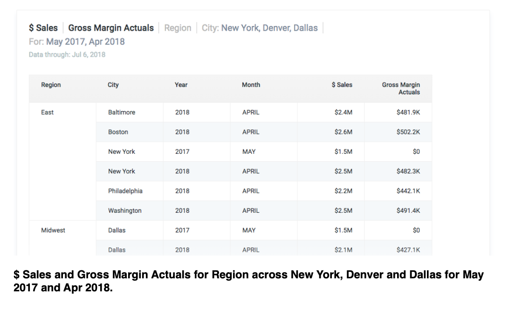

# Data-to-Text System

This repository is a brief description of the work I did during my Summer Internship at [cuddle.ai](http://www.cuddle.ai), a subsidiary of [Fractal Analytics Pvt. Ltd.](https://fractalanalytics.com). I cannot share the codes due to the Non-Disclosure Agreement signed. The Problem presented, the Approach I took and the Results obtained is displayed below.

## Introduction

Data-to-text systems are systems that generates texts from non-linguistic input data. Such systems needs to perform data analysis as well as linguistic processing. Data-to-text systems are powerful in generating reports from data automatically and thus they simplify the representation of complex data with numerous datapoint.
  
Data-to-text Systems are primarily comprised of two sub-systems:
  
1.	Numerical Insights Extraction
2.	Natural Language Generation
  
The architecture of a typical data-to-text system is shown below:
  

	</IMG>

### Insights Extraction

The data science part of a data-to-text system is responsible for performing mathematical calculations, preprocessing and other useful operations to extract the valuable information from raw data. This part outputs all the events and anomalies in data which acts as an input for the NLG system. NLG system then performs several tasks and make certain choices to output the necessary informations.
  
Data Science part do not perform a pre-defined specific pipeline to get to the result. The steps performed depends on the type of data, its distribution etc. Some of the common techniques that are generally performed are:
  
1.	Data Cleaning:

 This involves preliminary examination of data, handling the missing data points and treatment of anomalies. This step generally involves choices like filling the missing data point with mean of data, median etc or simply remove the complete row.
  
2.	Data Visualisation and Preprocessing:

 This involves visualising the input data, perform basic mathematical analysis and take the required steps to further clean the data and make it available for different algorithms. Intuition also plays a role in this.
  
3.	Feature Engineering:

 This is useful when there is a possibility to create a new feature based on the existing features and this new feature can be used in steps ahead. Basic feature engineering steps include addition of two columns, taking log of two columns etc. The final feature created depends on the data available and the output required.
  
4.	Statistical Techniques:

 Basic statistical operations like calculation of mean and standard deviations are performed in this step to get an insight about the hidden information in data.  
5.	Machine Learning:

 Several supervised, unsupervised or reinforcement learning methods can be applied(like Decision Tree, k-means clustering, KNN etc) on preprocesses data depending upon the needs and requirement of the results.  
6.	Deep Learning:

 If the data is in plenty and the preprocessing has been done well, deep learning algorithms(like CNNs, LSTMs etc) can also be applied to capture finer details and pattern from the data.
  

Depending on the needs, some or all of the steps mentioned above are performed on data. The end output of the data-to-text system is a set of important events in the data. This output is fed into a Natural Language Generation system for further shortlisting and hence, to create a textual summary of data in human language.

### Natural Language Generation

Natural Language Generation systems aims at providing insights by processing huge chunks of data and generation a Human Readable textual summary. In NLG, system needs to make decisions about how to put concepts into words.
  
Natural Language Generation systems are not simply Natural Language Understanding systems run “in-reverse”. One of the most prominent difference between NLG and other types of NLP is the central role of choice making. Choice making is more central to NLG than other areas of NLP.
  
Different Natural Language Generation tasks are:

#### Document Planner



Document Planner step involves the following:
  
1.	Content Determination: This decides what information to communicate in the text
 
2.	Document Structuring: This decides how this information is organised in the generated text


  
The input to document planner is the input to entire NLG system. The output of document planner is a tree of messages. Messages are chunks of information(extracted from input data) which can be linguistically expressed as a clause or phrase. The edges of the tree are often used to represent rhetorical relations between messages.


#### Micro-planning



Micro-planning deals with how information is linguistically expressed in generated text.
This involves four parts:
  
1.	Lexical choice: choosing which concept word to use to express domain concepts and data
 
2.	Referring: choosing referring expressions to identify domain entities
 
3.	Syntactic choice: syntactic structure in generated text sentence
 
4.	Aggregation:  choosing how many messages should be expressed in each sentence

  

The input to micro-planner is the document plan. The output of the micro-planner is the text specification. Essentially this is a tree whose internal nodes specifying document structure(eg: paragraph) and whose leaf node specify deep syntactic structures of sentences. Micro-planning requires an NLG system to make decision about the best way to linguistically express information.


#### Realisation



The realiser generates the Surface form(actual form) based on the information selected by the document planning and the linguistic choice made by micro-planner. Realiser connects the different parts of sentences by making the required changes and adding the required features.
  
There are some methods for evaluation of the generated text by an NLG system like **BLEU**(Bilingual Evaluation Understudy) but the best method by far is Human evaluation. Extrinsic evaluation or metric based corpus evaluation are based on pattern matching or comparisons with reference text. These scores are good to get a preliminary idea of how the model is performing but not to present end results. A human evaluator can present diversity and make changes as required to make the system perform better.

## Problem

#### To create a Data-to-Text system for cuddle.ai

Cuddle.ai is a Business Analysis platform which provides personalised assistance about your business. It is a Fractal Analytics product. Cuddle understands major business related questions and answers them effortlessly, thus providing a clear insight in almost insignificant amount of time. Cuddle saves time and effort by answering questions that a user can possibly have about their business.
  
Cuddle shows answers to a user’s query in one of the four visualisations mentioned below:
  
1.	Number:
 This method of visualisation displays an answer by showing a numeric value
 

	</IMG>

2.	Trend:
 This visualisation shows answer in the form of a trend chart distributed across time axis. It shows the variation of time series data over time 

	</IMG>

3.	Bar:
 Bar visualisation is helpful for comparison among different entities across a particular quantity


	</IMG>

4.	Table:
 This shows the answer in the form of a table

	</IMG>

 
Cuddle is smart enough to choose the best representation among these different kinds of visualisations present.
  
The problem on which I got to work upon during my internship was to create a Title and a human language textual Summary of all the different kinds of visualisations shown above i.e., creation of a Data-to-Text system for cuddle.ai

Visualisations are good for representing data(compared to raw form), but they too miss most of the useful insights until studied carefully. Having a Title for what is displayed on the screen and a crisp and useful summary will prove to be very helpful for users to take important business decisions efficiently in lesser amount of time

## Approach

Data-to-Text systems has two parts, Data Science and NLG realisation.
 
#### Data Science



This part is responsible for recognising useful events in the data. Several approaches like ARIMA models, neural networks etc were experimented upon and the final algorithm used is an ensemble of several algorithms. The final algorithm successfully captures trend in data to a reasonable extend and satisfactory results are obtained.

 
The steps involved for complete trend analysis are:

 
1.	Moving Average is used to smoothen the data 
2.	The complete data is divided into several smaller
 segments and the number of segments
 depends upon the size of data 
3.	Linear regression is applied on each of the segment for
 partial trend detection
 
4.	Once the partial trend is detected, the angle of
the Linear Regression lines obtained for
 each segment is used to remove redundancy
 by grouping the trend line with reasonably less
 variations together
 
5.	The final points obtained explains the complete trend of data
 
6.	Peaks and Valleys are obtained by using
 z-scores 

	</IMG>

	</IMG>

	</IMG>

	</IMG>

 



The Title for trend is generated by observing the overall
slope of Linear Regression line on complete data.

Recent trend is shown instead of complete trend by the algorithm described above, if the query is in present tense and the user is more interested in recent activities.

Statistical Values like mean, standard deviation etc are obtained by using their mathematical expression.

The largest drop between two bars in a bar graph is obtained by calculating the difference between each consecutive bars and the maximum of the differences is used.



#### Natural Language Generation



The NLG System here is inspired by the architecture proposed by Reiter and Dale. Data Science part is responsible for performing mathematical computations and operations to obtain the required information. Once we have the required information from the data, it is the responsibility of NLG system to make choices about what information to show and in what manner.





 
1.	Document Planner

 \
Document Planner decides which informations to show out of all the informations available. Too much of information might lead to bad readability and and thus defies the very purpose
 of data-to-text system.
In trend, our document planner selects whether to show the complete explanation of trend
 or the recent trend. This depends on the number of data points available and the tense in
 which the question is asked  
2.	Micro-planning

 
Micro-planning with the choice of word that should be used to represent the concepts better.
 This part is mainly used in trend analysis to distinguish between constant, moderate and
 steep trends.
 The role of the micro-planning
 module is to decide which
 specific words should be
 selected to express the content,
 decide upon the expression to
 use and aggregate the
 generated message in some
 form of linguistic structure.

 The words are selected from the
    table shown to represent different types of trends clearly, thus
 making the NLG Summary more impactful

	</IMG>

 
3.	Realisation

 
The realisation part converts the representation words and phrases in the micro-planning
 step into an actual text containing grammatical rules. The realiser defines the structure
 of document and add valid punctuations, conjunctions etc. The realiser also handle the tense
 of sentence and makes necessary changes.

 In our NLG system, realiser is mainly used to handle the tense of the answer and provide
 proper connecting words to form a meaningful sentence
 
All the codes to implement above algorithms is written in java. The simplenlg library is used for Natural Language Generation.

## Results

	</IMG>

	</IMG>

	</IMG>

	</IMG>

	</IMG>

	</IMG>

## Conclusion

Data-to-Text Systems are extremely useful. Large amount of data is generated on daily basis and its hard for a human to handle such amount of data in less time. Data-to-Text Systems acts as a bridge between huge amount of available data and the hidden insights within.
  
The data-to-text system created during my internship gives can act as a start to create a state-of-art Natural Language Generation system. The data generated can be collected in a database, which can later be used to train a Deep Learning Sequence models.
  
The system created has a large scope for improvement. The sentences generated can be reframed to be more presentable and useful for business purpose. An extensive survey about the expected output can be useful to get a more clear vision about future works. More relevant words can be added to the dictionary to provide more variety in generated text. The type of statistical information displayed can be varied depending upon the business requirements and use.

The implemented Data-to-Text system is seen to capture insights that are difficult to recognise by merely seeing the visualisation and it is impossible to capture by seeing just the raw data. The system automatically forms easily readable sentences when just the key words and phrases are provided. The rules of grammar are handled with reasonable accuracy.

## References

[1] Hadi Banaee, Mobyen Uddin Ahmed, Amy Loutfi, *A Framework for Automatic Text Generation of Trends in Physiological Time Series Data*, 2013 IEEE International Conference on Systems, Man and Cybernetics 
[2] Albert Gatt and Ehud Reiter, *SimpleNLG: A realisation engine for practical applications*, University of Aberdeen 
[3] Ehud Reiter, *An Architecture for Data-to-Text Systems*, University of Aberdeen 
[4] Kedar Dhamdhere, Kevin S. McCurley, Ralfi Nahmias, Mukund Sundararajan, Qiqi Yan, *Analyza: Exploring Data with Conversation*, Google Research 
[5] English Corner, *How to describe trend?*, Hong Kong Institute of Accredited Accounting Technicians 
[6] Seniz Demir, Sandra Carberry, Kathleen F. McCoy, *Summarizing Information Graphics Textually*, MIT Journal 
[6] The Handbook of Computational Linguistics and Natural Language Processing 
[7] Chris Venour and Ehud Reiter, *A tutorial for simplenlg* 
[8] Daniel Jurafsky and James H. Martin, *Speech and Language Processing* 